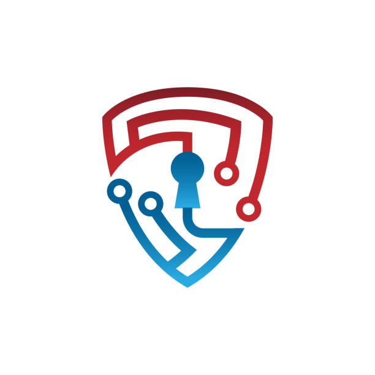

# cyber-tech

<html lang="en">
<head>
    <meta charset="UTF-8">
    <meta name="viewport" content="width=device-width, initial-scale=1.0">
    <title>cyber security intern</title>
    <link rel="stylesheet" href="cyber.css">
</head>
<body style="color: aliceblue;">
    

        

            <h1>Cyber Security Intern</h1>
        

        

            <a class="gap">Ethical hacking Intern</a>
            <a class="gap">Web Tech Intern</a>
            <a class="gap">Sql Intern</a>
            

        

    
 

    

        

            <h2>Welcome to Cyber Tech</h2>
            
Welcome to Cyber Tech. We help students and beginners gain real-world skills through practical internship programs. Our goal is to bridge  the gap between classroom learning and industry needs. At Cyber Tech, we offer hands-on training in Cyber Security, Web technology, and  Sql These internships help you understand how things work in real jobs by giving you project-based experience. Whether you want to protect  data, build websites, our programs are designed to make you job-ready with the skills that companies are looking for.

            <div-pro>
            

                
Why Choose Inlighn Tech?  
            🔹 Verified Experience Letter -QR code-enabled, easily verifiable on our website! 
            🔹 Enhance Your Resume & Credibility  - Gain industry-recognized experience. 
            🔹 Flexible & Remote Internships  - Learn at your own pace from anywhere. 
            🔹 Hands-on Real-World Projects  - Build practical skills employers seek. 
            🔹 Exclusive Perks & Career Growth  - Unlock new opportunities! 

            ✅ 100% Virtual & Work-from-Home - No travel, no hassle! 
            ✅ Expert Mentorship - Get guidance from industry professionals.

            

            

                Our Mission & Vision 

            🎯 Mission: Empower interns with industry-relevant skills for career success. 
            🌟 Vision: Shaping the next generation of tech leaders through immersive learning.  
            📞 Call/WhatsApp: +91 9368842663 
            📧 Email: info@cybertech.com   
            

                <label for="name">Name:</label>
                <input type="text" id="name" name="name" placeholder="Enter your name">
                 
                <label for="number">Ph.Number:</label>
                <input type="numbers" id="number" placeholder="Enter your Ph.Number"> 
                

                    
                    <button>LOGIN</button>

                 
                
            

        

        

    
   
</body>
</html>

